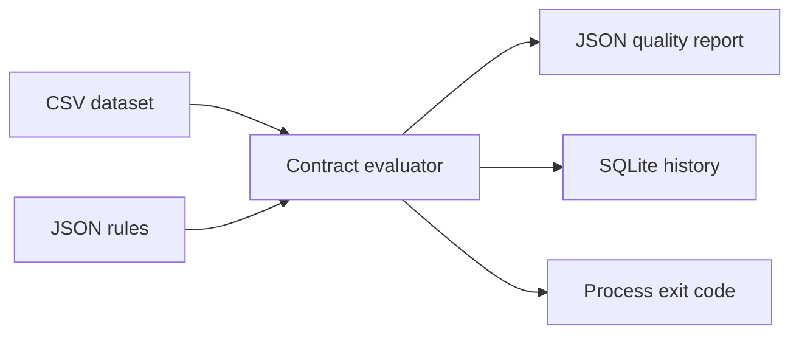

# Data Contract Monitor

A configurable data-quality gate for CSV ingestion. It checks schema, nulls, uniqueness, numeric ranges, allowed values, and record freshness, then stores an audit trail. This portfolio example uses synthetic order data.

## Run

Python 3.12; standard library only:

```bash
python demo.py
python -m unittest discover -s tests -v
python demo.py --input data/bad.csv
```

The good file passes and exits 0. The bad file exits 1 and reports duplicate IDs, negative/NaN amounts, an unsupported status, and stale data. The default clock is fixed for a reproducible demo; set `--as-of` to your actual evaluation time for live use. Inspect `results/report.json` and `results/quality.sqlite`.

## Contract and output

`contracts/orders.json` defines the dataset rules. Results contain check names and failure counts, not complete source rows. Freshness checks every record; the newest row cannot hide stale records. Empty files fail the minimum-row and freshness requirements. The monitor does not clean, repair, or silently drop failed input.



## Integration and limits

Call the evaluator before a warehouse load or run the CLI as an orchestration step. A failing exit code can stop downstream tasks. This implementation reads one CSV into memory and uses a single local audit database. Production extensions include chunked checks, centralized metrics, severity levels, contract versioning, and alert routing. No notification service or cloud scheduler is configured here.
